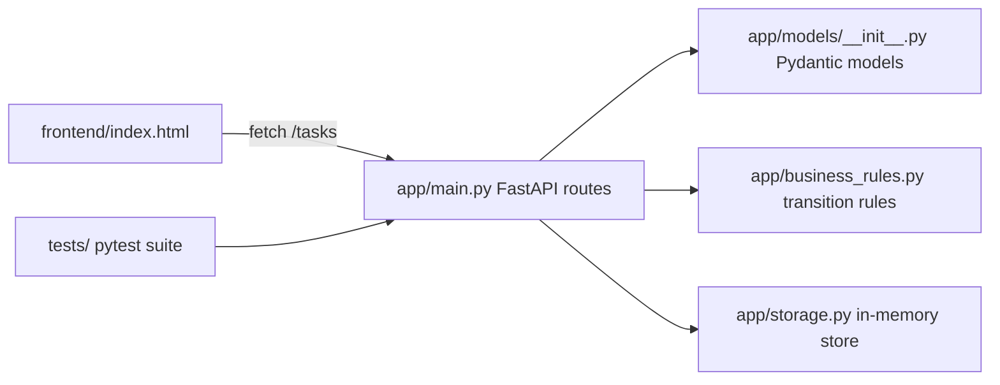

# Architecture - Module 5.5

This document synthesizes the best parts of three context strategies:

- Strategy A: minimal context and repository discovery.
- Strategy B: structured context from `AGENTS.md`, `README.md`, and main files.
- Strategy C: targeted context limited to the API/model/storage/business-rule
  files, tests, and frontend behavior contract.

## What The Project Does

Task Tracker is a course learning project with a FastAPI backend and a
single-file vanilla JavaScript Kanban frontend. It supports creating, listing,
filtering, reading, updating, and deleting tasks. It also enforces
status-transition rules, supports due dates, computes overdue tasks, and filters
by status, priority, assignee, search text, and overdue state.

The app is intentionally simple: no authentication, no database, no ORM, no
frontend framework, and no external service.

## Architecture Overview

## Data Module

The task model lives in `app/models/__init__.py`, not a separate
`app/models.py` file. The package defines:

- `TaskStatus`: `ToDo`, `InProgress`, `Done`.
- `TaskPriority`: `Low`, `Medium`, `High`.
- `TaskCreate`: create payload, forbids unknown/server-owned fields.
- `TaskUpdate`: partial update payload, forbids unknown/server-owned fields.
- `TaskResponse`: returned task with `id`, timestamps, and editable fields.

Title validation strips whitespace, rejects blank titles, and caps titles at
200 characters. Due dates use date-only values.

## Storage

`app/storage.py` is the whole persistence layer. It stores tasks in the
module-level `_tasks` dictionary, generates UUID string ids, and assigns
timezone-aware UTC timestamps. The store is process-local and resets on restart.
That is intentional for this learning project.

The storage layer also implements list filters. Filters combine with AND:
`status`, `priority`, `assignee`, `search`, and `overdue`. Overdue is computed,
not stored: a task is overdue when its `due_date` is before today and its status
is not `Done`.

## Request Flow

1. The browser sends a fetch request to the backend.
2. `app/main.py` receives the request and FastAPI validates query/path/body
   values with Pydantic.
3. For status PATCHes, the route retrieves the existing task and calls
   `validate_status_transition(existing.status, payload.status)`.
4. `app/storage.py` creates, filters, updates, or deletes the task.
5. The route returns `TaskResponse`, a list of responses, 204 on delete, 404 for
   missing resources, or 422 for validation/transition failures.
6. The frontend refreshes the board or shows the relevant error state.

## Business Rules

Allowed status transitions are:

- `ToDo -> InProgress`
- `InProgress -> Done`
- `Done -> InProgress`

Rejected transitions include `ToDo -> Done`, `Done -> ToDo`, and same-status
moves. The frontend depends on this: drag/drop optimistically moves a card, then
reverts when the backend rejects a transition with 422.

## Frontend

`frontend/index.html` is a self-contained Kanban board. It handles:

- board rendering and column counts,
- priority sorting,
- loading/ready/empty/error states,
- API-driven search and filters,
- drag/drop status changes,
- create/edit modal behavior,
- local blank-title prevention,
- server error display for invalid transitions.

The behavior checklist is documented in `frontend/BEHAVIOR_CONTRACT.md`.

## Verification

The automated API suite lives in `tests/`. `tests/conftest.py` resets storage
before and after every test. `tests/test_tasks.py` covers CRUD, validation,
transition rules, due dates, overdue filtering, search, combined filters, and
invalid filter values. The current suite has 30 tests.

Docker and CI exist for backend verification and packaging. The Dockerfile runs
the API as a non-root user and checks `/health`.

## Context Strategy Comparison

| Strategy | Context given | Strength | Weakness | Best use |
|---|---|---|---|---|
| A - Minimal | Little up-front repo context; discover as needed | Fast, good for rough orientation | Can stay generic and miss exact constraints | First-pass summaries, low-risk orientation |
| B - Structured | `AGENTS.md`, README, main modules, tests, frontend contract | Best overall project picture | Can produce longer output and include more than the task needs | Onboarding docs, architecture notes, planning |
| C - Targeted | Exact behavior-critical files only | Precise and honest about inspected scope | Misses CI/Docker/docs context unless included | Bug fixes, security-sensitive review, API behavior changes |

## Context Rule

Use **structured context** when the goal is to explain, plan, or onboard: start
with `AGENTS.md`, README, and the main files.

Use **targeted context** when the goal is correctness, security, or a risky code
change: name the exact files, ask the agent to cite what it inspected, and make
it say what it did not inspect.

Use **minimal context** only for rough orientation. Do not treat a minimal-context
answer as a repo plan until it has been checked against real files.

